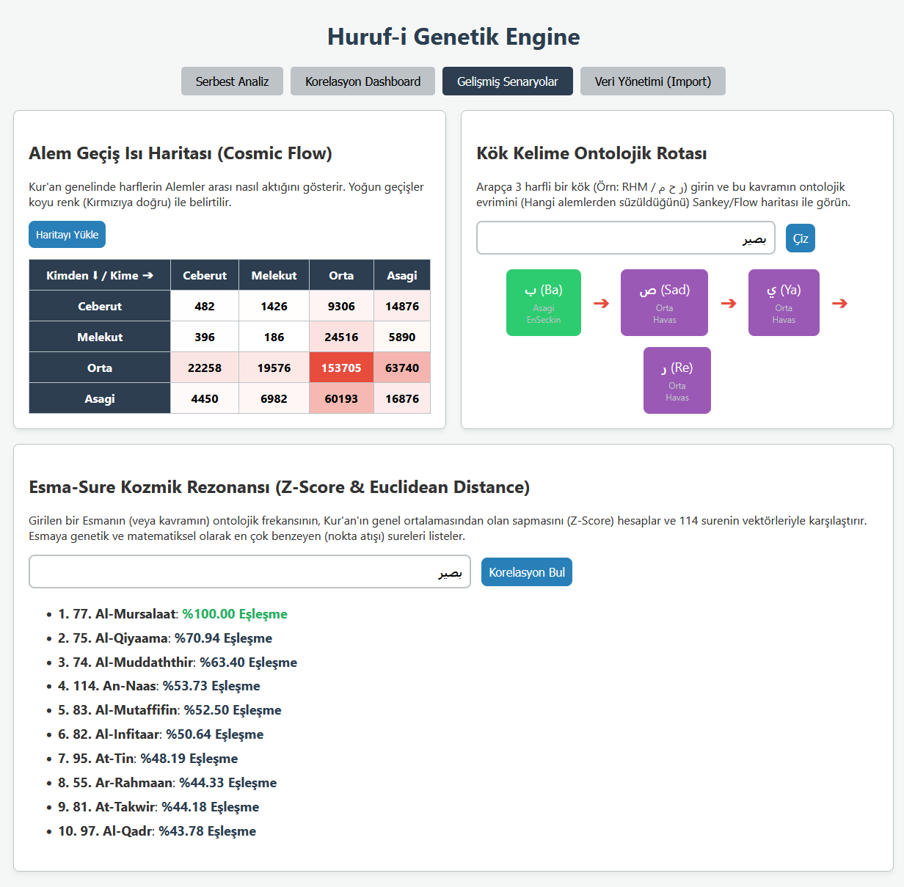
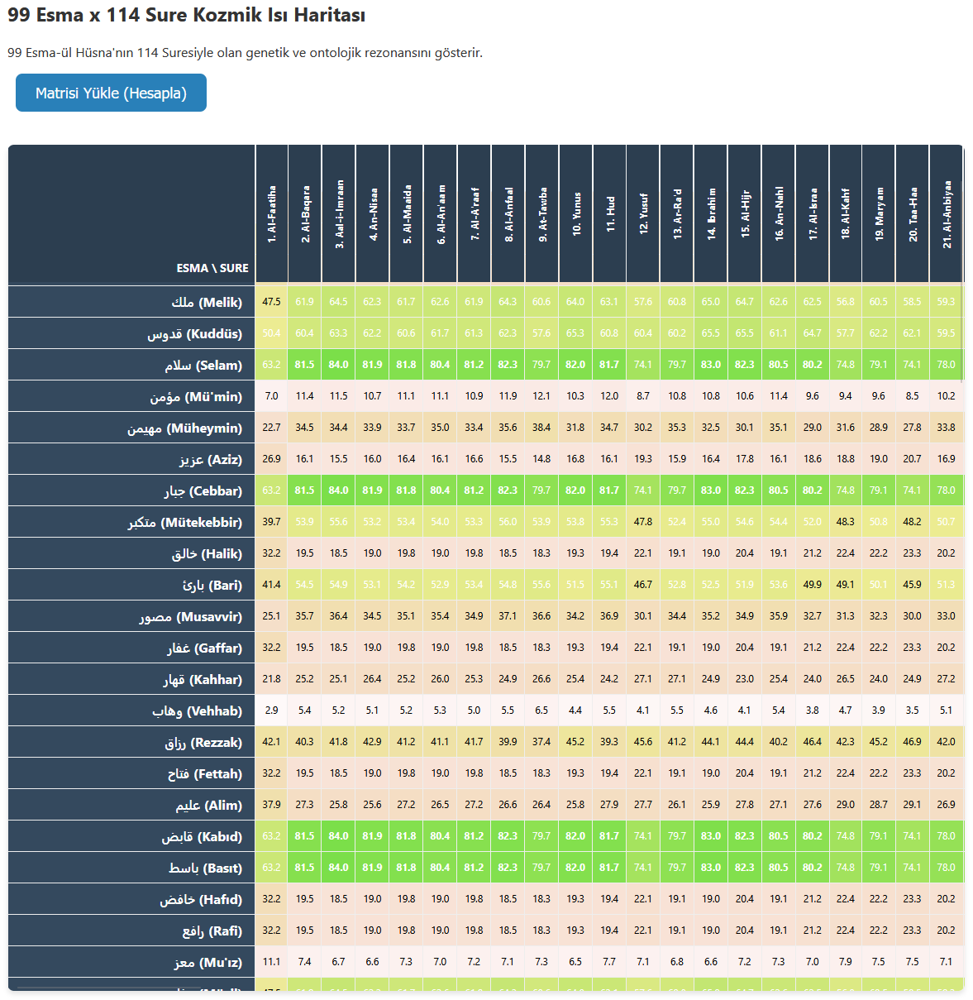

# Huruf-i Genetik (Kozmik Rezonans)

Huruf-i Genetik, Muhyiddin İbn Arabi'nin *Fütuhat-ı Mekkiye* eserindeki (5. Bölüm) ontolojik evren haritasından yola çıkarak Kur'an-ı Kerim metninin kozmik ve ontolojik genetiğini çıkartan gelişmiş bir Go ve Neo4j (Graph Database) analiz motorudur.

Projenin temel amacı; Kur'an'daki 29 harfi sıradan bir alfabe olarak değil, evrenin yaratılışındaki "Alemler" (Ceberut, Melekut, Orta, Aşağı) ve "Mertebeler" üzerinden şifrelenmiş kozmolojik yapı taşları olarak matematiksel ve görsel bir boyutta incelemektir.

<p align="center">
  
</p>
<p align="center">
  
</p>

## Özellikler (Use Cases)

Proje, düz bir metin analizi yerine ileri seviye veri bilimi ve graph algoritmalarını harmanlayan yaratıcı özellikler sunar:

### 1. Kozmik Geçiş (Cosmic Flow) Isı Haritası
Kur'an-ı Kerim boyunca harflerin (yani alemlerin) birbirlerine nasıl bağlandığını gösteren genel bir yönelim haritasıdır. Yüksek geçişler (Örneğin: Melekut aleminden Aşağı aleme akış) kırmızıya çalan yoğun renklerle görselleştirilir. Bu sayede vahyin enerjisinin hangi boyutlar arasında daha yoğun titreştiği gözlemlenebilir.

### 2. Kök Kelime Ontolojik Rotası (Sankey Haritası)
Girdiğiniz herhangi 3 harfli bir Arapça kökün (Örn: RHM / ر ح م), alemler arası nasıl süzüldüğünü ve ontolojik evrimini aşama aşama çizer. Her bir harfin hangi alemden gelip hangi aleme doğru aktığını, görsel bir nehir (Sankey) formatında izlemenize olanak tanır.

### 3. Esma-Sure Kozmik Rezonansı (Z-Score & Euclidean Distance)
Bir Esma-ül Hüsna (Örn: بصير) girdiğinizde, Esmanın genetik frekansını çıkarır. Daha sonra Kur'an'daki 114 surenin ortalama "standart sapmalarını (Z-Score)" hesaplar ve Esmanın genetik koduyla, surelerin genetik kodu arasındaki "Normalize Edilmiş Öklid Uzaklığını (Euclidean Distance)" bulur. Bu sayede Esmanın matematiksel karakterine en çok benzeyen sureler büyük bir hassasiyetle (% olarak) listelenir.

### 4. 99 Esma x 114 Sure Devasa Kozmik Matris (Heatmap)
99 Esma-ül Hüsna ile 114 Surenin tamamını tek bir sayfada 11.286 çapraz analiz işlemiyle karşılaştıran devasa bir ısı haritasıdır. Hangi surenin "Celali" (Örn: Kahhar, Cebbar), hangi surenin "Cemali" (Örn: Rahman, Vedud) kodlarla daha fazla rezonans halinde olduğunu harita üzerinden yeşil (yüksek rezonans) ve kırmızı (zıtlık/düşük rezonans) tonlarıyla tek bakışta izleyebilirsiniz.

---

## Kurulum ve Çalıştırma

Proje **Go** (Backend), **Neo4j** (Veritabanı) ve Vanilla JS (Önyüz) ile geliştirilmiştir.

### Gereksinimler
- Go (1.20+)
- Docker & Docker Compose (Neo4j veritabanı için)

### Adım Adım Kurulum

**1. Neo4j Veritabanını Başlatın:**
Proje dizininde yer alan `docker-compose.yml` dosyasını kullanarak veritabanını ayağa kaldırın:
```bash
docker-compose up -d
```
*(Eğer veritabanını sıfırlamak isterseniz `docker-compose down -v` kullanabilirsiniz.)*

**2. Sunucuyu Derleyip Başlatın:**
```bash
cd huruf-genetik
go mod tidy
go build -o server main.go
./server
```

**3. Arayüze Erişin ve Veriyi Import Edin:**
- Tarayıcınızdan `http://localhost:8080` adresine gidin.
- Kur'an verisini Neo4j'ye kaydetmek için **"Veri Yönetimi (Import)"** sekmesinden **"İçe Aktar"** tuşuna basın.
- *Not: API limitlerini korumak için import işlemi ilk seferde `quran_cache.json` dosyasına kaydedilir ve sonraki importlar doğrudan bu lokal dosyadan saniyeler içinde yapılır.*
- Terminalde `Quran Import Successfully Completed!` yazısını görene kadar bekleyin.

**4. Gelişmiş Senaryoları Keşfedin:**
Import tamamlandıktan sonra üst menüdeki "Gelişmiş Senaryolar" veya "Kozmik Matris" sekmelerinden tüm algoritmaları canlı olarak çalıştırabilirsiniz.

## Mimari

- `main.go`: HTTP Sunucusunun başlatılması ve rotalar.
- `models/letter.go`: İbn Arabi'nin harf ontolojisi (29 harf) ve veri modelleri.
- `repository/neo4j_repository.go`: Graph DB bağlantıları ve Transaction logları.
- `services/engine.go`: Z-Score, Euclidean Distance, Matrix oluşturma gibi ana beyin/hesaplama operasyonları.
- `services/quran_importer.go`: AlQuran Cloud API üzerinden verinin çekilmesi ve lokal önbelleğe (Cache) alınması.
- `web/templates/index.html`: Kullanıcı arayüzü ve Javascript (Vis.js ve özel HTML Heatmap'ler) kodları.
